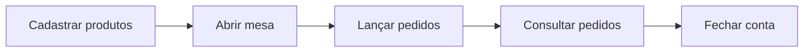

<div align="center">

# 🍽️ MenuTech

### Gerencie cardápio e pedidos do seu restaurante direto no terminal


</div>

---

## 📖 Sobre o projeto

O **MenuTech** é um sistema simples de gestão de restaurante rodando no terminal. Com ele é possível cadastrar produtos no cardápio, abrir mesas, lançar pedidos e fechar contas, tudo em poucos passos.

Foi desenvolvido como projeto estudantil para praticar **Python**, **manipulação de arquivos JSON**, **dicionários e listas**, **laços de repetição** e **`match/case`**.

---

## ✨ Funcionalidades

| # | Opção | O que faz |
|:-:|-------|-----------|
| 1 | ➕ **Adicionar item** | Cadastra nome e preço do produto, com código gerado automaticamente |
| 2 | 📋 **Consultar cardápio** | Lista todos os itens com nome, código e preço |
| 3 | 🪑 **Abrir mesa e pedir** | Abre uma mesa (ou reaproveita uma aberta) e lança itens por código e quantidade |
| 4 | 🔎 **Consultar pedidos** | Mostra pedidos e total de todas as mesas abertas |
| 5 | 💰 **Fechar conta** | Exibe o resumo da mesa e encerra a conta |

---

## 🖥️ Demonstração

```text
===================================

        MENU PRINCIPAL

        1- Adicionar item no cardápio
        2- Consultar cardápio
        3- Abrir mesa e adicionar pedido
        4- Consultar pedido da mesa
        5- Fechar conta

===================================
Digite o número da opção desejada: 3

Digite o número da mesa: 5
Mesa aberta com sucesso!
Digite o código do produto: 1
Quantidade: 2
-> Adicionado: 2 x PIZZA (R$ 80.00)
```

---

## 🚀 Como executar

### Pré-requisitos

- 🐍 [Python 3.10+](https://www.python.org/downloads/)
- 🪟 Windows *(o programa usa `cls` para limpar a tela)*

### Passo a passo

```bash
# 1. Clone o repositório
git clone https://github.com/samykuroda/MenuTech.git

# 2. Acesse a pasta do projeto
cd MenuTech

# 3. Execute
python main.py
```

---

## 🧭 Fluxo de uso sugerido



---

## 💾 Armazenamento de dados

| Dado | Onde fica | Persiste ao fechar? |
|------|-----------|:-------------------:|
| 📋 Cardápio | `cardapio.json` | ✅ Sim |
| 🪑 Mesas e pedidos | Memória | ❌ Não |

---

## 🛠️ Tecnologias

- **Python 3.10+**
- Biblioteca padrão: `json` e `os`

---

## 🔮 Próximos passos

- [ ] Salvar mesas e pedidos em arquivo
- [ ] Editar e remover itens do cardápio
- [ ] Tratar entradas inválidas (letras no lugar de números)
- [ ] Suporte a Linux e macOS
- [ ] Histórico de contas fechadas e relatório de vendas

---

<div align="center">

Feito com 💜 por [Samy Kuroda](https://github.com/samykuroda)

⭐ Se gostou do projeto, deixe uma estrela!

</div>
